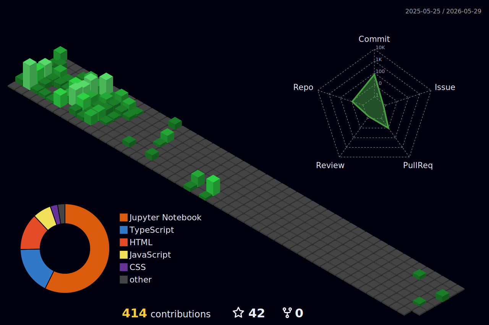

+ao+meu+Git!&center=true&size=30&pause=1000&color=ffffff&width=1000&cursorColor=ff0000&duration=4000)

##

  

<!--

 -->

 |  |  |  
 | ----------- | ----------- |

 

  

##

  

 

  <h3>Visitas ao Perfil</h3>
  

 ##

   
